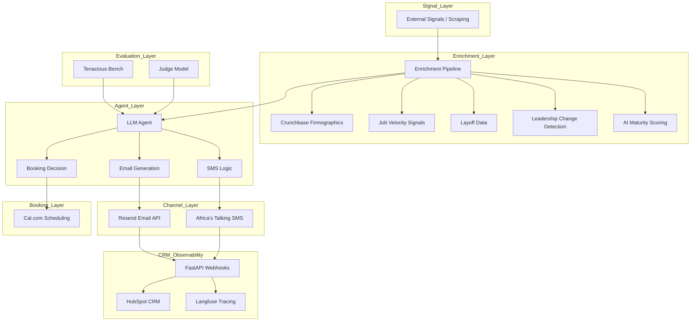

# 🚀 The Tenacious Conversion Engine + Tenacious-Bench v1.0
**TRP1 Week 10 & 11 Final Submission — Addisu Taye**

---

## 📌 Overview

The Tenacious Conversion Engine is an AI-assisted system that converts real-world business signals into qualified B2B sales conversations and booked meetings.

Week 10 delivered a **fully functional multi-channel pipeline**.  
Week 11 introduced **Tenacious-Bench**, a domain-specific benchmark and trained **judge/critic model** to ensure output quality and production reliability.

---

## 🧠 Problem Statement

Traditional outbound sales suffers from:

- Generic messaging  
- Low personalization  
- Poor conversion rates  

AI improves scale but introduces:

- Ungrounded responses  
- Overpromising / unsafe claims  
- Lack of actionable next steps  

👉 Solution: Combine **signal-driven generation + evaluation + training**

---

## 🏗️ System Architecture



---

## 🛠️ Production Stack

| Component     | Provider           | Status      |
|---------------|--------------------|-------------|
| Email         | Resend             | ✅ Verified |
| SMS           | Africa's Talking   | ✅ Verified |
| CRM           | HubSpot Sandbox    | ✅ Verified |
| Booking       | Cal.com            | ✅ Verified |
| Observability | Langfuse           | ✅ Verified |

---

## 📊 Enrichment Pipeline

Produces structured prospect intelligence:

- Firmographics (Crunchbase ODM)
- Job-post velocity
- Layoffs.fyi integration
- Leadership change detection
- AI maturity scoring (0–3)

---

## 🧪 Tenacious-Bench Dataset

- **200 structured tasks**
- Train / Dev / Held-out splits
- **Real-world segments**:
  - Series B startup
  - Mid-market restructure
  - New CTO transition
  - Capability gap
  - Objection-heavy

### Evaluation Dimensions
- Signal grounding
- Tone adherence
- Actionability
- Constraint safety

---

## 🧠 Dataset Authoring (Four Modes)

1. **Trace-derived tasks** — Week 10 logs
2. **Programmatic generation** — scalable task creation
3. **Multi-LLM synthesis** — variation in tone & structure
4. **Adversarial cases** — failure-mode injection

---

## ⚙️ Methodology

### Path B — Preference-Tuned Judge / Critic

**Why Path B?**
- Infrastructure already works
- Problem = inconsistent output quality
- Judge enforces production-safe outputs

### 🧠 Training

- **Model**: Qwen2.5-0.5B-Instruct
- **Method**: LoRA fine-tuning
- **Training pairs**: 108
- **Trainable params**: ~1.75%

#### Training Results

| Epoch | Train Loss | Val Loss |
|-------|------------|----------|
| 1     | 1.89       | 0.72     |
| 2     | 0.36       | 0.29     |

---

## 📈 Evaluation Results

| Metric      | Baseline | Improved |
|-------------|----------|----------|
| Mean Score  | 0.62     | 0.77     |
| 95% CI      | [0.58–0.66] | [0.73–0.81] |

---

## 🔍 Delta Analysis

### Delta A (Headline)
+0.15 improvement in mean score

### Delta B (Prompt Baseline Honesty)

Prompt-only approach:
- Slight tone improvement
- Inconsistent grounding
- No reliability

👉 **Training is required for production quality.**

---

## 💰 Cost Analysis

| System      | Cost per Task |
|-------------|---------------|
| Baseline    | ~$0.002       |
| With Judge  | ~$0.0025      |

+ $0.0005 per task (~25%)

👉 Justified by higher conversion quality and reduced risk.

---

## 🧪 Evaluation Pipeline

- Rule-based evaluator
- Judge/critic model
- Held-out validation
- Anti-leakage policy

---

## 🔐 Anti-Leakage Policy

- Strict train/dev/held-out separation
- No training on held-out
- Deterministic evaluator
- Planned embedding checks

---

## 📂 Repository Structure

```
├── agent/
├── configs/
├── eval/
├── scripts/
├── generation_scripts/
├── synthesis_memos/
├── tenacious_bench_v0.1/
├── training_data/
├── training/
├── ablations/
├── seed/
├── model_card.md
├── methodology_rationale.md
├── audit_memo.md
├── dataset_authoring.md
├── multi_llm_policy.md
├── judge_pipeline.md
├── results.json
├── cost_log.csv
└── README.md
```

---

## 🤖 Model Artifacts

⚠️ Large model files are not stored in GitHub.

👉 Download trained adapter:
`Google Drive / HuggingFace link (add here)`

---

## 📅 Production Recommendation

Deploy under:
- Human-in-the-loop validation
- A/B testing
- Langfuse monitoring
- Gradual rollout

---

## 🏁 Final Decision

**Proceed to controlled production deployment with judge model enabled.**